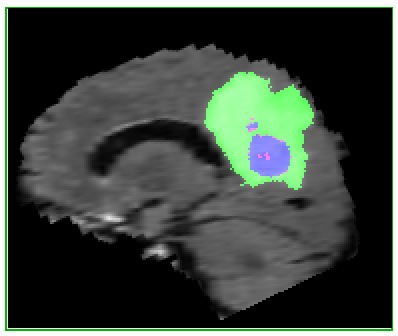
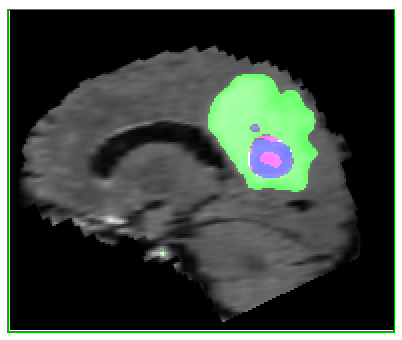
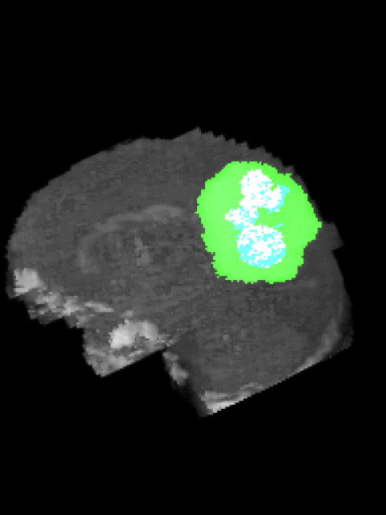
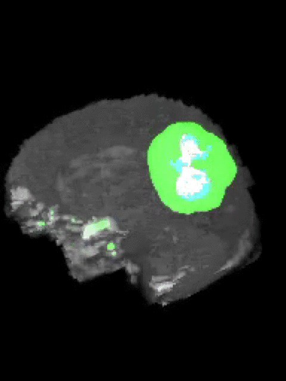

# Brain-Tumor-Segmentation-3D-UNet-CNN

## Refactoring:
- ~~Add tensorboard callback in addition to early stopping and saving models~~
- ~~Make it an argument whether you’d like to run with multioutput or not~~
- ~~Pathlib to support windows pathing~~
- ~~Separate train val test splitting from image preprocessing~~
- ~~Try running training file~~
- ~~Try running again on GPU~~
- Try creating predictions
- Try creating tiffs of predictions
- Hyperparameter tuning and cross-validation
- Finally, train on full dataset
- Incorporate transfer learning
- Incorporate other modern refinements
- Create functions for:
    - Cropping and saving
    - Aligning the segmentation back to the original uncropped image
    - Figure out how to reverse the cropping and one-hot encoding to make the output submittable

Brain tumor segmentation using a 3D UNet CNN

I used Keras with a Tensorflow backend. This UNet was built for the MICCAI BraTS dataset: https://www.med.upenn.edu/sbia/brats2018/data.html

I achieved a dice score of 0.78 and weighted dice score of 0.67. I treated both tumor types (low-grade glioma and high-grade glioma, LGG and HGG) together. Papers that separate the task for each tumor subtype can perform better with respect to these scores.

This U-Net was built for the [MICCAI BraTS dataset][BraTS]. This U-Net was based on the one constructed in [this paper (Isensee 2017)][Isensee 2017]. The [original U-Net paper](https://arxiv.org/abs/1505.04597) is from 2015, so the architecture is still quite new. It performs extremely well for segmentation tasks that require a lot of precision and for which there is not a lot of example data. There were a total of 285 patients in this dataset. Typically, for neural networks to be trained well on image classification tasks, there are tens of thousands of example training images.

I cropped the images to 240x240x155 and used the four types of MRI contrasts per patient as different channels, yielding volumes with final input dimensions of 4x240x240x155.

The first half of the U-net is effectively a typical convolutional neural network like one would construct for an image classification task, with successive rounds of zero-padded ReLU-activated convolutions and ReLU-activated max-pooling layers. Instead of classification occurring at the "bottom" of the U, symmetrical upsampling and convolution layers are used to bring the pixel-wise prediction layer back to the original dimensions of the input image.

Here is the architecture for the 2D U-Net from the original publication mentioned earlier:

There are 3 tumor regions that are being determined in the ground truth and the predictions. From largest to smallest, these are:
1. Edema^
2. Enhancing tumor core
3. Necrotic tumor core

The ground truth segmentation comes as a single channel coded 0,1,2,4 for the different regions and 0 as no tumor. I converted this to a 3-channel image with each channel corresponding to a single tumor region prediction of 0 or 1 for each pixel. Correspondingly, I output predictions for for the 3 tumor regions into separate channels with a binary classification for each channel.

Here's an example of the correlation between my predictions in a single 2D plane:

Ground Truth:               |  Prediction:
:-------------------------:|:-------------------------:
  |  

Here's an example of the correlation between my predictions in a rotating 3D volume plane:

Ground Truth:               |  Prediction:
:-------------------------:|:-------------------------:
  |  

Reload the page or click each image to see the gif loop again.

The UNet was based on this paper: https://arxiv.org/abs/1802.10508

My presentation for this work is here: [talk](./Brain_Tumor_Segmentation_Talk.pptx)

Blog post about this project: https://jack-etheredge.github.io/Brain-tumor-segmentation-with-3D-UNet-CNN/

To do:
- Clean code
- Add alternative versions for 8xGPU
- Add alternative versions for on-the-fly image cropping versus pulling from pre-cropped pickle files

I heavily modified code from two sources to get this project to work:

- Original code for building the UNet was from this repo: https://github.com/ellisdg/3DUnetCNN
- Original code for the data generator: https://stanford.edu/~shervine/blog/keras-how-to-generate-data-on-the-fly.html

[Isensee 2017]: https://arxiv.org/abs/1802.10508
[BraTS]: https://www.med.upenn.edu/sbia/brats2018/data.html
